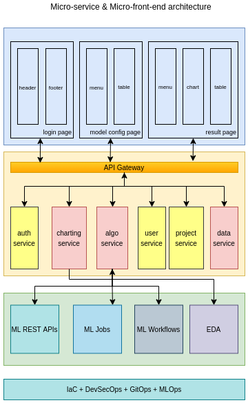
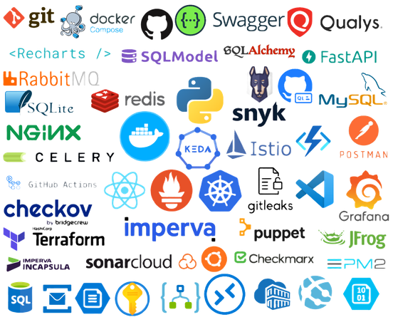
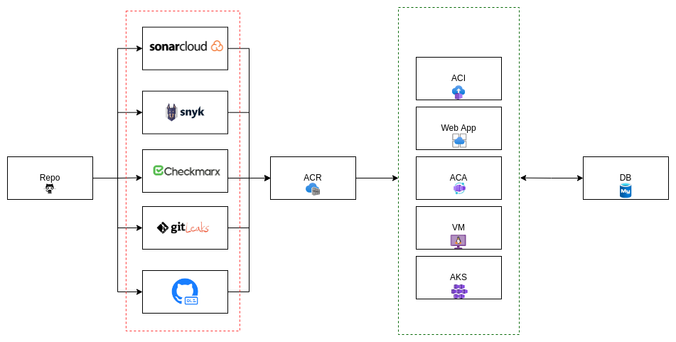
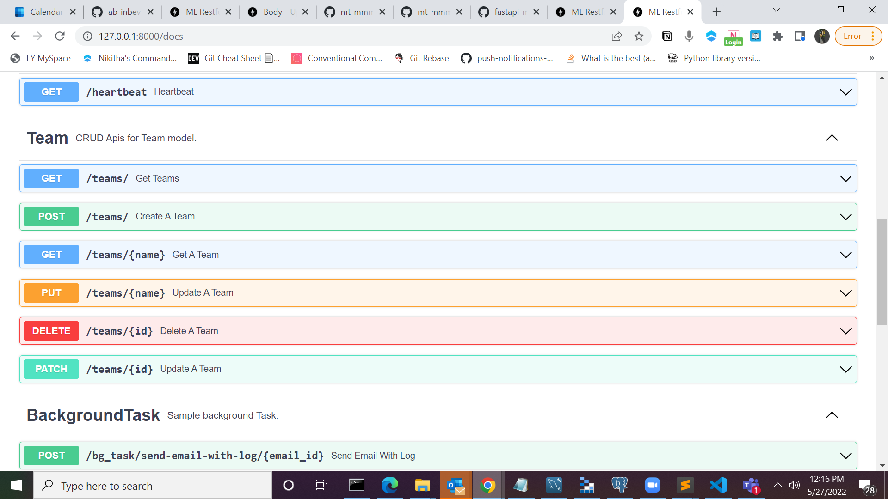
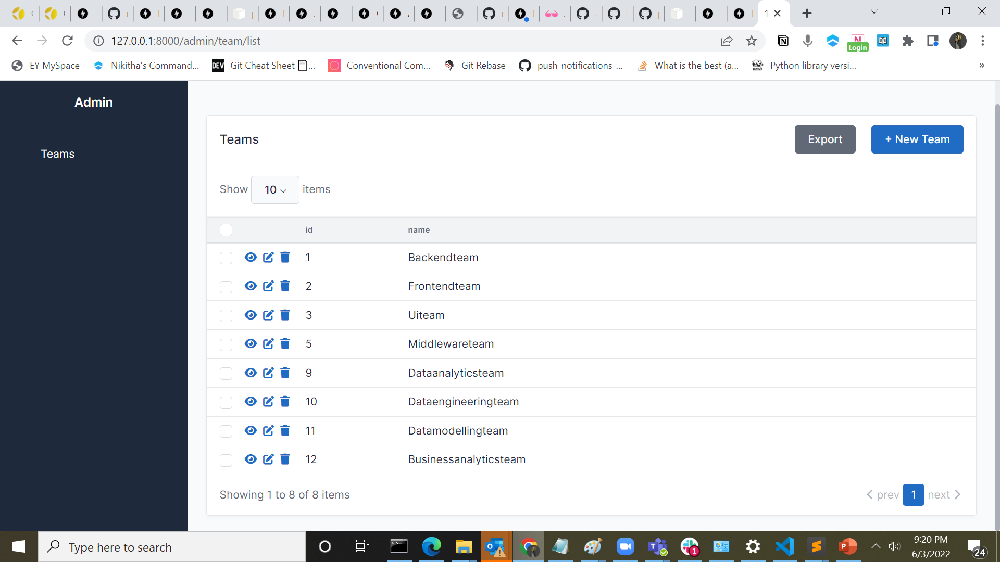
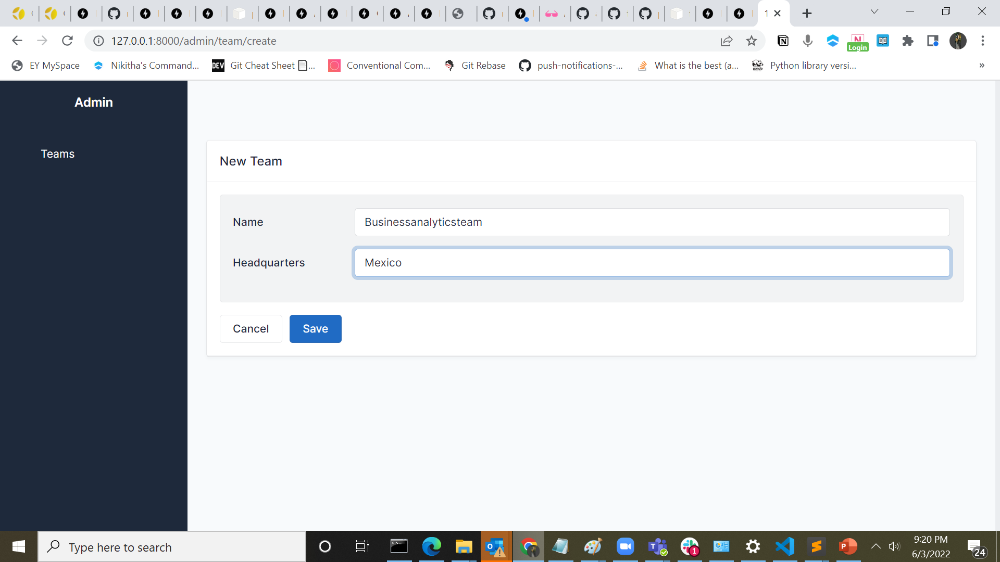
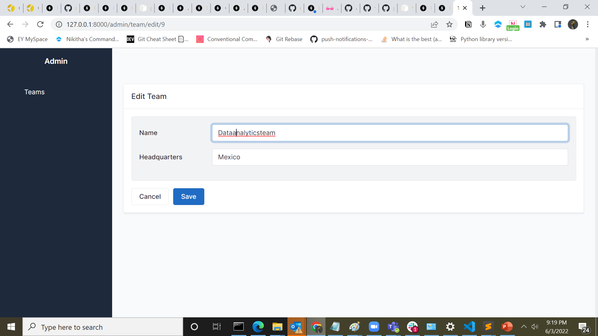

<p align="center">
  
</p>
<p align="center">
  <em>⚡ ML RESTful API template using FastAPI </em> ⚡</br>
  <sub>A dynamic FastAPI application base template is fast, well tested, and production ready.
</sub>
</p>

---

**Documentation**: <a href="https://github.com/ab-inbev-analytics/ml-restful-api-template" target="_blank">https://github.com/ab-inbev-analytics/ml-restful-api-template</a>

**Source Code**: <a href="https://github.com/ab-inbev-analytics/ml-restful-api-template" target="_blank">https://github.com/ab-inbev-analytics/ml-restful-api-template</a>

---

## 📣 Info

ML RESTful API template using FastAPI which includes below feature.


## 🔰 Installation

**Use pip**
```bash
pip install -r requirements.txt
```

## 👨🏽‍💻 Design diagram

<p align="center">
  
</p>

## 📝 Resources

➝ [01. Directory structure & files](https://web.microsoftstream.com/video/9c0ba854-22dd-4c6d-ab7b-67d565973767)\
➝ [02. Create new conda env & usage of Makefile](https://web.microsoftstream.com/video/bcde8cc9-51de-4ff2-9d03-3c86ed87372d)\
➝ [03. Contribution guide](https://web.microsoftstream.com/video/2a4371b2-dd5b-41aa-960b-b8dbdf372c7b)\
➝ [04. Documentation](https://web.microsoftstream.com/video/91c3910b-84dd-4b72-8107-2abcadb4aa58)\
➝ [05. Micro-service, micro-frontend & cross functional pods](https://web.microsoftstream.com/video/2310319b-1396-4780-9797-69f6e5feca87)\

## 🗒 Tech stack

<p align="center">
  
</p>

## 🚀 Pre-requisite




### ➡ Decision

One has to finalize where this app will be hosted. Note, AKS is not for a service. Hence it will be kept outside of scope. For AKS related deployment contact with `Ashwini.Ramachandra@AB-inbev.com`.

### ➡ Components & access

➝ 3 service principles\
➝ Service email\
➝ Access to Sonar Cloud\
➝ Access to Snyk
➝ Access to Check Marx\
➝ Azure MySQL cloud DB\
➝ Azure container registry\
➝ Azure key vault\
➝ Azure storage with Blob\
➝ Deployment instance\
  ➝ Azure web app\
  ➝ Azure container registry\
  ➝ Azure container instance\
  ➝ Azure VM (with SSH access and required ports opened) + Azure application gateway (WAF2 enabled)\

### ➡ Configurations

➝ `SPN 1 (AKV spn)` should have read write permission over the AKV.\
➝ `SPN 2 (ACR spn)` should have pull and push in scope of permission.\
➝ `SPN 3 (Deployment SPN)` should have permission to deploy a image from ACR to deployment instance.\
➝ `SPN 1` related info should be stored in GitHub secrets as `AZURE_CREDENTIALS`.\
➝ `SPN 2` and `SPN 3` client id and client secrets has to be stored in AKV.\
➝ `SNYK_ORGID` and `SNYK_TOKEN` has to be stored in AKV.\
➝ `SONAR_TOKEN` has to be stored in AKV.\
➝ `CHECKMARX_TEAMS`, `CHECKMARX_URL`, `CHECKMARX_USERNAME`, `CHECKMARX_PASSWORD` and `CHECKMARX_CLIENT_SECRET` has to be stored in AKV.\
➝ Deployment instance's and developers IP has to be whitelisted in the development VM or DB if required.\
➝ `projectKey`, `organization`, `projectName` has to be updated in `sonar-project.properties`\
➝ `site_name`, `site_description`, `site_author` has to be updated in `mkdocs.yml`\
➝ If you are running in a VM you can use the default image `FROM tiangolo/uvicorn-gunicorn-fastapi:python3.8` but to run this in a cloud component or AKS this has to be changed to a python base image or number of workers has to be restricted because auto-scaling in these are take care by cloud component or KEDA depending on the deployment instance.\
➝ `VERSION` file in project root has to be updated with the latest version. Docker image will pickup version from this file as tags.\
➝ One `env` file has to be created in the project root with the following content,\

```bash
    PROJECT_NAME=AdditionAPI
    BACKEND_CORS_ORIGINS=["http://localhost:8000","https://localhost:8000","http://localhost","https://localhost"]
    MYSQL_ROOT_PASSWORD=development
    MYSQL_USER=user
    MYSQL_PASSWORD=password
    MYSQL_HOST=database
    MYSQL_PORT=3306
    MYSQL_DATABASE=app
    DATABASE_URI=sqlite+aiosqlite:///app.db
```
➝ Note: If you are running this from local then only pass `DATABASE_URI=sqlite+aiosqlite:///app.db`. Otherwise remove this.\

## 🤖 CI/CD pipelines

### ➡ci-branch-naming-checks.yml 

  ➝ No action required.

### ➡ci-build.yml

  ➝ `AZURE_CREDENTIALS` need to be updated in GitHub secret.
  ➝ `VERSION` file in project root should be updated.
  ➝ `keyvault` value need to be updated.
  ➝ `secrets` values has to be updated with SPN details
  ➝ `REGISTRY_LOGIN_SERVER` has to be updated in GitHub secret
  ➝ `IMAGE_NAME` has to be upto date in GitHub secrets
  ➝ `SNYK_TOKEN` has to be upto date.

### ➡ci-change-log.yml -

  ➝ `release_version` should pickup the latest version from `VERSION` file.

### ➡ci-delete-old-workflows.yml 
  
  ➝ No action required.

### ➡ci-pr-validator.yml - 

  ➝ `PYTHON_VERSION`, `ACR_NAME`, `TEAM`, `PRODUCT`, `COMPONENT`, `COMPONENT_TYPE`, `IMAGE_NAME`, `DEPLOYMENT_TYPE`, `WIKI_CONTAINER_NAME`, `DB_CONTAINER_NAME`, `DATA_CONTAINER_NAME` & `DB_TYPE` has to be updated in the github actions.  `AZURE_STORAGE_CONNECTION_STRING`, `SONAR_TOKEN` and `SNYK_TOKEN` has to be upto date in github secrets.

### ➡ci-prune-branches.yml

  ➝ No action required.

### ➡ci-release-drafter.yml
  
  ➝ No action required.

### ➡ci-security-checks.yml
  
  ➝  `CHECKMARX_TEAMS`, `CHECKMARX_URL`, `CHECKMARX_USERNAME`, `CHECKMARX_PASSWORD` and `CHECKMARX_CLIENT_SECRET` is required.

### ➡ci-update-monorepo.yml
  
  ➝ `PARENT_REPOSITORY`,`CHECKOUT_BRANCH`,`PR_AGAINST_BRANCH`,`OWNER` these end variables needs to be updated in github actions. `github_token`, `parent_repository`, `checkout_branch`, `pr_against_branch` and `owner` arguments needs to be updated in github actions

### ➡ci-branch-naming-checks

  ➝ We need to define a valid branch tag in `branch_pattern` argument in `ci-branch-naming-checks.yml` files. By default branch tags are,

      ➝ feat
      ➝ fix
      ➝ docs
      ➝ style
      ➝ docs
      ➝ refactor
      ➝ perf
      ➝ test
      ➝ build
      ➝ ci
      ➝ chore
      ➝ revert

  
  ➝ Valid example of a feature branch is `feat/vehicle-mix-chart-integration-AB#1237`. Here `AB#<ticket id>` will like the feature with the Azure DevOps.

### ➡ci-build

Whenever there is a push to the `develop` branch this action will do the following things in a github actions runner,

➝ Download the latest code
➝ Login to Azure using Azure CLI
➝ Extract the latest version from `VERSION` file in id `getbuildversion` as variable `version`. This will be used later.
➝ The runner will login to the ACR using SPN's client id and secrets.
➝ This will build two images one with `version` tag and another with `latest` tags.
➝ This will run a snyk scan of vulnerability.
➝ If the snyk scan is working this will push the image with both the tags to the azure container registry.

### ➡  __ci-delete-old-workflows__

This workflow will delete all the older workflow run from github actions section. Check the parameters of `Mattraks/delete-workflow-runs@v2`, do modify the default behavior.


### ➡  __ci-pr-validator__

  ➝ No action required.


## 🎫 Directory structure of the project

```bash
.
├── app                                   # Fast API project directory
│   ├── core                              # All the core component can be stored here
│   │   ├── config.py                     # Application level config will be here
│   │   └── __init__.py                   # __init__ file
│   ├── database.py                       # All the database related code will be here
│   ├── __init__.py                       # __init__ file
│   ├── main.py                           # Fast API main entrypoint file
│   ├── models.py                         # All the database will be defined in this file
│   ├── routers                           # All the routers or sub-modules can be stored here
│   ├── schemas                           # All the request and response models will be defined here
│   ├── services                          # Any functions related to a service can be stored here
│   ├── settings.py                       # Application level settings can be configured here
│   └── utils                             # Any common utility script can be stored here
├── changelog-ci-config.yml               # This file is for generating change logs
├── CHANGELOG.md                          # Automatically generated change log file
├── CODE_OF_CONDUCT.md                    # Code of conduct
├── CODEOWNERS                            # Define your code owners here
├── CONTRIBUTING.md                       # How to contribute to this project
├── docker-compose.yml                    # Docker compose file to run the service in local with MySQL DB
├── Dockerfile                            # Standalone docker file for the respective service
├── docs                                  # All the raw documents for wiki should be stored here
│   ├── index.md                          # Wiki docs
│   ├── javascripts                       # Additional JS files for wiki
│   │   └── extra.js                      # Additional JS files for wiki
│   └── stylesheets                       # Additional CSS files for wiki
│       └── extra.css                     # Additional CSS files for wiki
├── LICENSE                               # LICENSE
├── Makefile                              # Makefile with all helper functions for the project
├── MANIFEST.in                           # MANIFEST file
├── pyproject.toml                        # Project level meta-data and tool's configuration
├── README.md                             # README file
├── requirements.txt                      # Python dependency file
├── SECURITY.md                           # SECURITY policy file
├── setup.cfg                             # Python project setup, other meta-data and configs
├── sonar-project.properties              # Sonar Cloud configurations
├── tests                                 # Project tests directory
│   ├── conftest.py                       # Test related configuration file
│   ├── __init__.py                       # __init__ file
│   └── test_main.py                      # Test script for unit tests related to `main.py`
└── VERSION                               # API version
```

## ⛏ Test the Code

```bash
pytests
```

## 💻 Run Application Local
```bash

cd ml-restful-api-template
uvicorn app.main:app --reload

```

## 🛢 Alembic Db Setup Migrations

```bash

cd ml-restful-api-template
alembic init alembic

```

### ➡ Update Alembic Migrations Settings

```bash

vi alembic/script.py.mako
  -> Add import statement

      import sqlmodel             # NEW

vi alembic/env.py
  -> Replace target_metadata=None statement

      from sqlmodel import SQLModel                       # NEW
      from app.models import ➝                            # NEW
      target_metadata = SQLModel.metadata                 # NEW

      import os                                           # NEW
      from dotenv import load_dotenv                      # NEW
      load_dotenv()                                       # NEW
      config.set_main_option('sqlalchemy.url', os.getenv("DATABASE_URL"))                                   # NEW
```

### ➡ Run Migrations

```bash

alembic revision --autogenerate -m "First migration."
alembic upgrade head

```

<!-- ## 🎫 Other important commands

### ➡ Kill the terminal process

```bash

netstat -ano | findstr :8000
taskkill /f /pid 

```
 -->

## 📚 API List

<p align="center">
  
</p>


## 👨🏻‍💻 CRUD Model Admin Panel

<p align="center">
  
</p>
<!-- 
<p align="center">
  
</p>


<p align="center">
  
</p>
 -->

## 🖥️ CLI App Commands

```bash

python cliapp.py ping

python cliapp.py heartbeat

```

## 🐋 Docker

```bash

docker build -t abimtmroigbdevacr.azurecr.io/ml-restful-api-template:latest .

docker-compose  -f docker-compose.yml down

docker-compose  -f docker-compose.yml build

docker-compose  -f docker-compose.yml up -d --remove-orphan

```

## 📖 References
https://testdriven.io/blog/fastapi-sqlmodel/


## ☑️ Completed

➝ Restructure the folders\
➝ Added SQLModel Models\
➝ Added Async alembic MYSQL Migrations\
➝ Updated Model Parameters\
➝ Added CRUD REST APIs\
➝ Added Background Tasks\
➝ Added CLI App to trigger the APIs\
➝ Added DockerFile\
➝ Added DockerCompose File\
➝ Seggregate CRUD Services from REST APIs\
➝ Converted Sync Calls to Async Calls\
➝ Integrate SQLAdmin(Fastapisqladmin)\
➝ Integrate fastapi basic auth(user name & password for app)\
➝ Integrate client id & client secret(fastapi simple security)\

## 🎯 TODOS

➝ Versioning(fastapi versioning)\
➝ fastapi utils(middleware)\
➝ locust\
➝ https://github.com/aminalaee/sqladmin\
➝ Add index to the model\
➝ db integration docker compose\
➝ Locust & coverage report\
